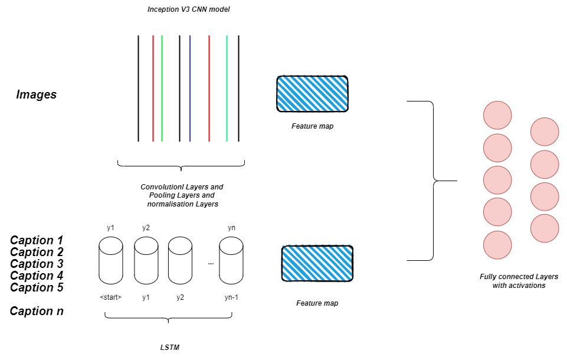

# Image-Captioning-using-CNN-LSTM

This project is focused on developing a model that can generate descriptive captions for given images. By analyzing the content of an image, the model will be able to predict an appropriate and accurate caption that reflects the scene or objects depicted.

## Architecture

